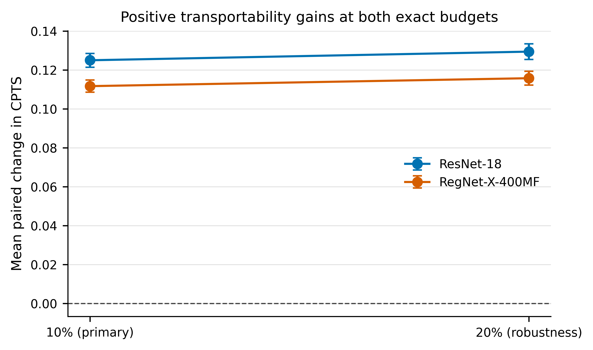

# TransXAI: Cross-Patient Explanation Transportability in Medical Imaging

Official code and aggregate results for **Cross-Patient Explanation Transportability in Medical Imaging**.

TransXAI is an explainer-agnostic, post-hoc support-refinement method. It operates on frozen classifiers and frozen explanation maps: no classifier retraining and no shared explainer parameters are introduced during refinement.

## Main result

At the primary exact 10% spatial budget, TransXAI increased the equal-cell mean Cross-Patient Transportability Score (CPTS) on both evaluated backbones:

| Backbone | Baseline CPTS | Refined CPTS | Delta CPTS | 95% CI |
|---|---:|---:|---:|---:|
| ResNet-18 | 0.4762 | 0.6012 | +0.1250 | [0.1214, 0.1285] |
| RegNet-X-400MF | 0.4857 | 0.5974 | +0.1117 | [0.1085, 0.1148] |

All 360 dataset-fold-explainer-backbone-budget cell means were positive. Exact mask cardinality and the frozen local-effect constraint had zero violations in the final paired panel.



## Experimental scope

- Datasets: SIIM-ACR, ISIC 2016, and PAD-UFES-20.
- Backbones: ResNet-18 and RegNet-X-400MF.
- Explainers: Grad-CAM, LayerCAM, Integrated Gradients, LRP, RISE, and Extremal Perturbation.
- Five grouped outer folds and 128 out-of-fold donors per dataset and fold.
- Exact spatial budgets: 10% (primary) and 20% (prespecified robustness analysis).
- Matching representation: the second convolutional stage, with spatial size 40 x 40 for 320 x 320 inputs.
- Intervention representation: the third convolutional stage, with spatial size 20 x 20.
- Recipient sets: 12 support, 12 validation, and 10 untouched query recipients.
- Frozen seed: `20260906`.

The frozen implementation identifier `T-CPT` remains in some configuration keys, output paths, and historical manifests. It refers to the method named **TransXAI** in the paper.

## Repository layout

```text
configs/             frozen experiment contracts
docs/                data, implementation, and reproduction notes
results/figures/     publication figures generated from aggregate results
results/manifests/   immutable run manifests and artifact hashes
results/tables/      aggregate and cell-level paper tables
scripts/             executable single-cell Colab scripts
tests/               release-integrity checks
```

Raw clinical images, model checkpoints, HDF5 explanation maps, local caches, and patient/donor-level records are intentionally not distributed.

## Reproduction order

Each file in `scripts/` is a self-contained Python cell intended for Google Colab. The default project root is:

```python
/content/gdrive/MyDrive/Colab Notebooks/CPET
```

Change `PROJECT_ROOT` consistently if a different Drive location is used.

| Stage | Script | Hardware | Purpose |
|---:|---|---|---|
| 1 | `01_colab_setup.py` | CPU | Public environment and project-layout setup |
| 2 | `02_preprocessing_and_splits.py` | CPU | Acquisition, auditing, and grouped folds |
| 2B | `02B_repair_pad_ufes20.py` | CPU | Frozen PAD-UFES-20 distribution repair used in the study |
| 3 | `03_train_resnet18.py` | GPU | Five-fold ResNet-18 classifiers |
| 3R | `03R_train_regnet_x_400mf.py` | GPU | Five-fold RegNet-X-400MF classifiers |
| 4 | `04_explainers_resnet18.py` | GPU | ResNet-18 OOF explanation maps |
| 4R | `04R_explainers_regnet_x_400mf.py` | GPU | RegNet OOF explanation maps |
| 6B | `06B_transxai_resnet18.py` | GPU | ResNet TransXAI refinement at 10% and 20% |
| 6R | `06R_transxai_regnet_x_400mf_budget10.py` | GPU | RegNet refinement at 10% |
| 6R | `06R_transxai_regnet_x_400mf_budget20.py` | GPU | RegNet refinement at 20% |
| 7 | `07_confirmatory_statistics_resnet18.py` | CPU | ResNet confirmatory analysis |
| 7R | `07R_backbone_replication_statistics.py` | CPU | Paired architectural replication |
| 8 | `08_reviewer_controls.py` | GPU | Compact controls and ablations |

The initial ResNet training script also processes BUS-UCLM as a development-only smoke dataset. BUS-UCLM is excluded from the confirmatory TransXAI pipeline and from all paper results.

For a syntax and release-integrity check:

```bash
python tests/validate_release.py
```

## Reproducing the reported statistics

The aggregate tables and publication figures are already included under `results/`. Full recomputation requires the external datasets and the large intermediate artifacts generated by stages 3-6. Statistical stages 7 and 7R additionally require the frozen donor-level Parquet outputs, which are withheld because they contain sample and grouping identifiers.

See [docs/REPRODUCIBILITY.md](docs/REPRODUCIBILITY.md) for the full contract and [docs/IMPLEMENTATION.md](docs/IMPLEMENTATION.md) for the exact implemented estimand.

## Data and privacy

No medical image is redistributed. Users must obtain each dataset from its original source and comply with the corresponding license and terms. See [docs/DATASETS.md](docs/DATASETS.md).

## Citation

If you use this repository, cite the accompanying paper. Machine-readable metadata are available in [CITATION.cff](CITATION.cff).

## License

The code is released under the [MIT License](LICENSE). Dataset licenses and third-party model or explainer licenses remain with their respective owners.
